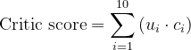

# Critic Matching - Critic Top Ten lists
#### link: <https://metacritic-top10.herokuapp.com/>
#### Description:

As a lover of movie reviews, a problem I often run into is my penchant for looking at average movie review scores from sites like Metacritic and Rottentomatoes rather than reading individual reviews. I say this is a problem because while I think average scores serve as good indicators of a film’s general quality, they largely miss the mark on accounting for individual preferences. For example, when dealing with a genre of films I’m not particularly fond of (let’s say Westerns), a movie could score a 90 on metacritic or rottentomatoes, but it could oppose my preferences of fast plots and well defined protagonists/antagonists. However, included within that aggregate score of 90, there likely exists a critic whose preferences match up with mine, and in forming a general perspective of what movies I should spend my time watching, it may be better to look at scores from a critic who shares similar preferences to my own than at aggregate scores. This is main purpose of my project: to help users find critics who share similar preferences and to recommend movies that are preferred by matched critics.
 
It’s important to establish early on some limitations in trying to do create this system. Likely the foremost one is the difficulty of assembling data. It was important to me that this project included some degree of webscraping, which is essentially the process of collecting data from a website using a programming language (in my case it was Python and the BeautifulSoup library). While it was my hope to build a database containing every critic review that goes into the aggregate scores on Metacritic, it proved too time consuming given the relatively limited amount of reviews per page on Metacritic (it would require a massive amount of refreshing and internet usage) and the formatting of their html pages. In lieu of every critics' review of every film in the span of time that Metacritic has been online, I instead used their annual "Critics Top 10 lists" because it addressed both of the issues I initially had of number of reviews per page and of html layout. So while I find this to be an adequate compromise given this project is designed partially as a learning process for myself, I would eventually like to give a more pertinent recommendation via a larger, more encompassing database. 
 
The database that I ended up making in sqlite via webscraping only contains films from 2011 to 2021, as that is how many years Metacritic has published its top ten lists for. Given that the source is published annually, the database is limited to ten films per critic per year. At most, a critic can have 110 films that are considered their favorites from the past 11 years. Ranking also presents some ambiguity because it isn’t always a good metric of differentiating preferences. For example, a critic could have a list from a year in which she likes all ten films roughly the same, but due to the nature of a ranking system there appears to be a relatively large preference gap between her 1st ranked film and her 10th ranked film. Regardless of these limitations, I still believe that if a user can complete the (somewhat difficult) task of giving true rankings of their ten favorite films from the past 11 years, that the program does a good job of presenting critic matches. 

 ##### Matching System:
Finding a critic match involves converting rankings into scores, multiplying user scores by critic scores for each critic, and summing those products to find the highest resulting score.
Converting ranks into scores works by taking the absolute value of each rank subracted by 11 and yields the following: 1st place gets 10 points, 2nd gets 9, 3rd gets 8, and so down to 10th place which gets 1 point. Unranked films receive a score of -8, as it was important for unranked films to reduce total scores by enough so that the highest scores are not entirely compromised of matches between a critic's and user's top 3 to 5 films and so that there is some weight for a high quantity of matches regardless of rankings. 



The formula above shows how to calculate the matching score for each critic, where c<sub>i</sub> and u<sub>i</sub> represent corresponding film scores for a critic and user respectively. Resulting scores can range from -440, which happens if a critic is missing all of the user's films from their top ten lists, to 550, which occurs when a critic has all of the user's films ranked in 1st place. After implementing this formula across every critic in the database, the program returns the ten critics with the highest scores as the best matches.

This scoring system is used primarily to account for critic lists spanning multiple years (this is explained further in the following example). Imagine the following user list, where the films are ranked in sequential order from 1st to 10th place. This list also happens to contain each of Peter Travers’ first ranked films over the past ten years.
```
User List 1:
The Power of the Dog, The Irishman, Boyhood, Dunkirk, Roma,
La La Land, Drive, Spotlight, The Master, Da 5 Bloods
```
Figure 1 displays a 2-dimensional space visualization of two other common matching methods for a user and critic of **cosine similarity** and **euclidean distance** for the movies *The Master* and *The Power of the Dog*.


The euclidean distance shows that the two score vectors are 8 points apart, while cosine similarity indicates the cosine of the angle (33.7°) between the vectors is .8321. In this case, cosine similarity and euclidean distance are somewhat misleading as they do not show Peter Travers as being the perfect match for the user, even though all of the user's films are Travers' favorites. This is due to the distance or simliarity aspect of both of those metrics, which would indicate a perfect match as a critic with not only matching films but the same rankings for each of those film. Graphically, in that instance the vectors for the user and critic would overlap, and therefore the distance as well as the angle between the vectors would be zero, which is ideal for both cosine similarity and euclidean distance. However, due to critic lists spanning multiple years, it is possible to have a list like user list 1 that contains multiple critic favorites. The scoring system accounts for this, with Travers being a perfect match per user list 1 -  maximizing his score via formula 1 [(10*10) + (9*10) + (8*10) + (7*10) + … = 550]. 

Euclidean distance also gives insight into why cosine similarity isn't ideal for this project. Per figure 1, if the user changed their scores so that *The Power of the Dog* was their 6th favorite film (score of 5) and *The Master* was their least favorite (score of 1), the cosine similarity score would be the same as if they didn't change their scores, but the euclidean distance between the points would increase (from 8 to 10.3). However, cosine similarity might be useful for future implementions where more data is available (like of review score, genre, etc..) since it is easy to scale into higher dimensions without implementing a score conversion system. 

~~This gives insight into why the scoring system is better for this case than Euclidean distance or cosine similarity, because the program should seek out matching users not only with critics who have the most films in common, but those who have also scored matched films the highest. Per user list 1, Peter Travers should be a perfect match - maximizing his score via formula 1 [(10*10) + (9*10) + (8*10) + (7*10) + … = 550], and this makes sense because we would want an ideal match to have all of our ranked films as their favorites rather than a critic who not only had matching films but also the same rankings as the user, whose score would be [(10*10) + (9*9) + (8*8) + (7*7) + … 385]. Both cosine similarity and euclidean distance would present the latter case as a perfect match since they don’t work nicely with the repeat rankings that can occur due to the annual basis of the critic top ten lists, hence why the scoring method is implemented as there would be no distance between each score if they were the rankings were the same for a critic and user. ~~ 


In the following sections, I will go through each important file for my program and give outlines of their functionalities.

###### 1. parsing_v3.py
This file uses the BeautifulSoup library to webscrape the Metacritic top 10 html pages into a sqlite database. It loops through the tables in an html file for each year and outputs each critic and their top 10 films for that year into a csv file.

###### 2. TopTen.db
Contains three tables:
```
critics
films
rankings
```
critics and films contains every critic and film (respectively) over the past 11 years and corresponding ids. rankings contains rankings paired with corresponding secondary keys of critics and films.

###### 3. Helpers.py
This is my main library file, containing functions to be imported into app.py. I will go in sequential order briefly explaining each function.
```
def find_user_id():
```
The user is inserted at the end of the TopTen database, so the user id is the length of the database plus one. 

```
def add_user(user_dict, user_id):
```
Function starts by converting rankings and films tables from TopTen.db into pandas dataframes. `for a in user_Title_list:` takes user_dict (passed dictionary of user film picks) and adds those titles to a list of ids. `user_df = pd.DataFrame(...)` creates a panda dataframe of films ranked by user and their subsequent rankings. `rankings_final` combines the panda database *user_df* with the *rankings* database which contains critic reviews. `rankings_matrix` creates a pivot table with an index (x-axis) as critic_id, columns as film_id and values as rankings. `matrix_final` is the table that is returned, and it is just `rankings_matrix` with the film column filtered to just be films that the user has reviewed. 

```
def score_conv(matrix_final):
```
Function takes *matrix_final*, which is the pivot table output by `def add_user`, and converts its values (rankings) into scores. If a film is unranked, it gets a score of -8, otherwise the score is the absolute value of the ranking subtracted by 11. 

```
def score(user_id, rankings_pd, k=10):
```
Function compares the user against critics and gives each critic a score, and outputs a list of the highest scoring critics. It does this by incrementing through *rankings_pd* (which is the output of `score_conv`) and multiplying the critic scores by user scores and summing that ouput up for each critic and appending it to a list. Once its done incrementing through *rankings_pd*, it sorts the list by highest scores and outputs a list of the 10 highest scoring critics. 

```
def ranking_dict(matrix, match_list):
```
This function outputs a dictionary of the top scoring critics and their films and rankings, and is structured roughly like this `{critic name: {film: score, ...}, ...}`

```
def critic_favorites(critic_matches):
```
This function returns a dictionary containing all of the films ranked by top scoring critics. Its output is structured roughly like this `{critic name: [film1, film2, ...], ...}`.

###### app.py
This is the main script (app) for the program, indicated by its name and `app = Flask(__name__)`. I will go in sequential order and briefly explain its functionality.

```
def render_home(alert_msg):
```
This function renders the page where users input their favorite films. It's most important feature is `film_list`, which is a list containing all unique films ranked by critics from 2011 to 2021 in alphabetical order. This list also checks for films that have disagreeable naming or formatting, such as films that are listed as "ties" and contain two films seperated by "AND". This list is passed to *home.html*, which uses the list in searchable dropdowns for users to search for films. It contains the error backstop of `alert_msg` in case a user doesn't submit 10 films, submits repeat picks, or selects films that aren't in `film_list`. 

```
def home():
```
Arguably the bread and butter of the program, this function recieves user film inputs and runs them through the functions from **helpers.py** and outputs an html page listing top scoring critics and their favorite films.
Once the user submits their favorite films via a POST request, the submissions are added to a dictionary *user_fav* in sequential order. It checks whether there are any empty strings, duplicates, or less than 10 inputs, and then proceeds to pass the *user_favs* dictionary to the **helpers.py** functions. It runs the **helpers.py** functions in sequential order: finding the user id via `find_user_id()`, creating the rankings matrix via `add_user()`, converting rankings into scores via `score_conv()`, and outputing high scoring critics via `score`. The function then converts high scoring critic names to a list, and creates another list of strings that represent links to pages where more of the critics reviews can be read. Once this complete, the **helpers.py** outputs and the search names are passed to the final output html page, *user_films.html*. 

###### home.html & user_films.html
Both of these use bootstrap styling, and are heavily based off of the design of CS50's Finance problem set. *home.html* lists 10 inputs, which each use jinja to list every unique film in the TopTen database. *user_films.html* takes the outputs from the functions from **helpers.py** and `def home():` from **app.py** and displays them on a html table. There is a table row from each critic, and a dropdown containing there favorite films as well as their rankings of the films included in the users top ten list. The critic names, as well as all the films in the dropdowns have links to their respective metacritic or rottentomatoes page, or their respective websites. 

##### Goals/Future Implementations:
As mentioned in the Description section, it was my initial hope to have a database that included every critic score for every film on Metacritic. Not only would this expand the number of films users are able to choose from, but it would give a more accurate recommendation as it eliminates some of the ambiguity surrounding preference differences in rankings. It would also be of use to have more information about the films in the database, such as genres and sub-genres, in order to allow for a more accurate collaborative filtering recommendation model that would enable recommendations to not only be made based off of films that matched critics also like, but ones based on common features of the users liked films. It would be nice to display the expanded film information just for UI enhancement purposes. 

It would also be interesting to add user inputs via a site like Letterboxd. Letterboxd is a sort of film review social media service, where people can post reviews of films and make lists of films, and post them to either to their friends on the site or to the entire site. This provides enhanced ease of use for my program, as it is often rather difficult to recall and choose ten favorite films in a single sitting. Letterboxd input would help eliminate this difficulty, as it could automatically import a users favorite films based on their inputs over time on Letterboxd. 

A more aesthetically appealing website is also of interest, though this of lower priority since it doesn't directly impact the programs functionality. One implementation in this regard would be adding film posters, which actually might positively impact functionality as it may make the selection of films easier for users (perhaps seeing a poster would help users to better remember certain films).
